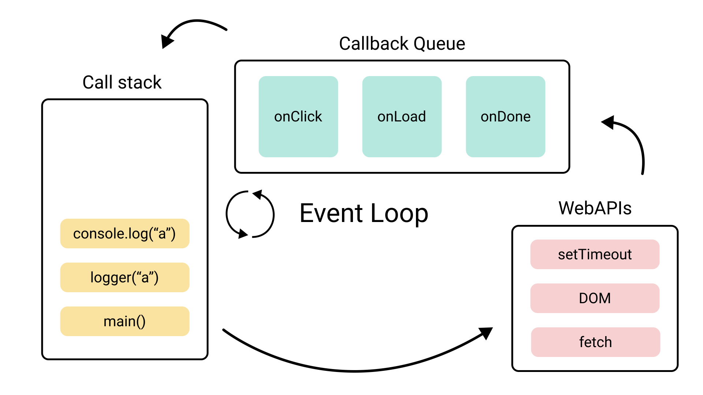

# 메모리에 대해 분석해보자 🤖

## 참고 주소

- [이벤트 루프](https://iamsjy17.github.io/javascript/2019/07/20/how-to-works-js.html)

## 데이터 할당 과정

1. 변수의 고유 식별자 생성
2. 메모리 할당

## 자바스크립트 엔진: 메모리 공간

- Call Stack: 원시 타입
- Heap: 참조 타입
  - 크기가 동적으로 변할 수 있음

Virtual Machine 내에 Call Stack과 Heap이 존재한다.

## 단일 데이터 VS 복합 데이터

- 단일 데이터: Call Stack에 저장
- 복합 데이터: Call Stack에 참조값이 저장되며, 실제 값은 Heap에 저장되어 관리됨

## 복합 데이터: const 키워드 활용해 할당

- 예시: 값을 재할당하는 복합 데이터
  ```js
  const obj = [];
  obj[1] = 1;
  obj[2] = 2;
  ```

const의 경우, 재할당 불가능한 키워드를 나타낸다.
복합 데이터를 const 키워드를 사용해 선언한 후, 값을 재할당해도 문제가 발생하지 않는다. 그 이유는 복합 데이터의 경우, 실제 값이 Heap에서 관리되었기 때문이다.

## 브라우저 엔진: 메모리 공간



- Queue 종류

  - Task Queue: 비동기 함수의 콜백 함수가 위치함
  - MicroTask Queue: Task Queue와 동일한 계층에 존재하며, 프로미스 비동기 호출 시 위치함
  - Animation Frames: requestAnimationFrame에 의해 등록됨

- Queue 처리

  - Event Loop: 현재 실행 중 실행 컨텍스트가 비었다면, 큐에서 대기 중인 함수를 Call Stack으로 이동

- Queue 우선 순위

  1. MicroTask Queue
  2. Animation Frames
  3. Task Queue

- Queue 처리 순서
  1. Call Stack 작업 처리
  2. Call Stack 비어 있음
  3. MicroTask Queue 확인하고, Call Stack에 넣음
  4. MicroTask Queue 비어 있다면, Animation Frames 확인하고, 브라우저 렌더링 발생
  5. Task Queue 확인하고, Call Stack에 넣음
